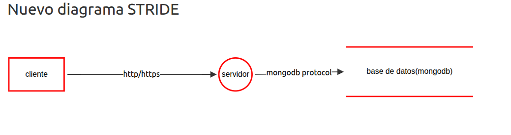

## Proyecto 

nombre OWASP Juice Shop
proyecto tipo laboratorio con vulnerabilidades de la 

## Tabla de Amenazas STRIDE

| Componente   | Tipo (STRIDE)           | Descripción                                                                 | Estado  | Prioridad | Mitigación                                                        |
|--------------|-------------------------|-----------------------------------------------------------------------------|---------|-----------|-------------------------------------------------------------------|
| Cliente      | Spoofing                | Un atacante puede suplantar a otro usuario mediante credenciales débiles.   | Abierto | Alta      | Autenticación robusta, contraseñas fuertes, tokens seguros.       |
| Cliente      | Repudiation             | El usuario puede negar acciones si no existen registros adecuados.           | Abierto | Media     | Implementar logs y auditoría de acciones.                         |

## Angular Frontend

| Componente   | Tipo (STRIDE)           | Descripción                                                                 | Estado  | Prioridad | Mitigación                                                        |
|--------------|-------------------------|-----------------------------------------------------------------------------|---------|-----------|-------------------------------------------------------------------|
| Angular      | Spoofing                | Manipulación de tokens OAuth2 o sesiones en el lado cliente.                | Abierto | Alta      | Validación de tokens en servidor, refresh tokens seguros.         |
| Angular      | Tampering               | Modificación de código JavaScript o datos en el navegador.                  | Abierto | Alta      | Code integrity checks, CSP headers, validación server-side.       |
| Angular      | Repudiation             | Acciones del frontend no registradas adecuadamente.                         | Abierto | Media     | Logging de eventos críticos del frontend.                         |
| Angular      | Information Disclosure  | Exposición de datos sensibles en código JavaScript o localStorage.          | Abierto | Crítica   | Cifrado de datos sensibles, no almacenar secretos en frontend.    |
| Angular      | Denial of Service       | Ataques que consumen recursos del navegador o sobrecarga de requests.       | Abierto | Media     | Rate limiting, timeout en requests, optimización de recursos.     |
| Angular      | Elevation of Privilege  | XSS permite ejecutar código con privilegios del usuario autenticado.        | Abierto | Crítica   | Sanitización de entradas, CSP, Angular security features.         |

## Servidor de Aplicaciones

| Componente   | Tipo (STRIDE)           | Descripción                                                                 | Estado  | Prioridad | Mitigación                                                        |
|--------------|-------------------------|-----------------------------------------------------------------------------|---------|-----------|-------------------------------------------------------------------|
| Servidor     | Spoofing                | El servidor acepta conexiones no autenticadas o de fuentes no confiables.   | Abierto | Media     | Validar origen y autenticación de usuarios.                       |
| Servidor     | Tampering               | Modificación de datos en tránsito entre servidor y base de datos.            | Abierto | Alta      | Validar y sanear datos antes de almacenarlos.                     |
| Servidor     | Repudiation             | Acciones no registradas en el servidor.                                     | Abierto | Media     | Auditoría y logs detallados.                                      |
| Servidor     | Information Disclosure  | Filtrado de información sensible por errores o configuraciones inseguras.    | Abierto | Crítica   | Configuración segura y control de errores.                        |
| Servidor     | Denial of Service       | Saturación por ataques de fuerza bruta o peticiones masivas.                 | Abierto | Alta      | Protección contra DoS y balanceo de carga.                        |
| Servidor     | Elevation of Privilege  | Vulnerabilidades permiten acceso a funciones administrativas.                | Abierto | Crítica   | Control estricto de permisos y validación de entradas.            |

| Componente   | Tipo (STRIDE)           | Descripción                                                                 | Estado  | Prioridad | Mitigación                                                        |
|--------------|-------------------------|-----------------------------------------------------------------------------|---------|-----------|-------------------------------------------------------------------|
| Base de Datos| Tampering               | Inyecciones NoSQL modifican datos maliciosamente.                           | Abierto | Crítica   | Validar y sanear consultas.                                       |
| Base de Datos| Repudiation             | Cambios no rastreables en la base de datos.                                 | Abierto | Media     | Auditoría y logs de cambios.                                      |
| Base de Datos| Information Disclosure  | Consultas mal diseñadas exponen datos sensibles.                            | Abierto | Crítica   | Control de acceso y consultas seguras.                            |
| Base de Datos| Denial of Service       | Consultas pesadas o maliciosas saturan la base de datos.                    | Abierto | Alta      | Optimización y límites de recursos.                               |
